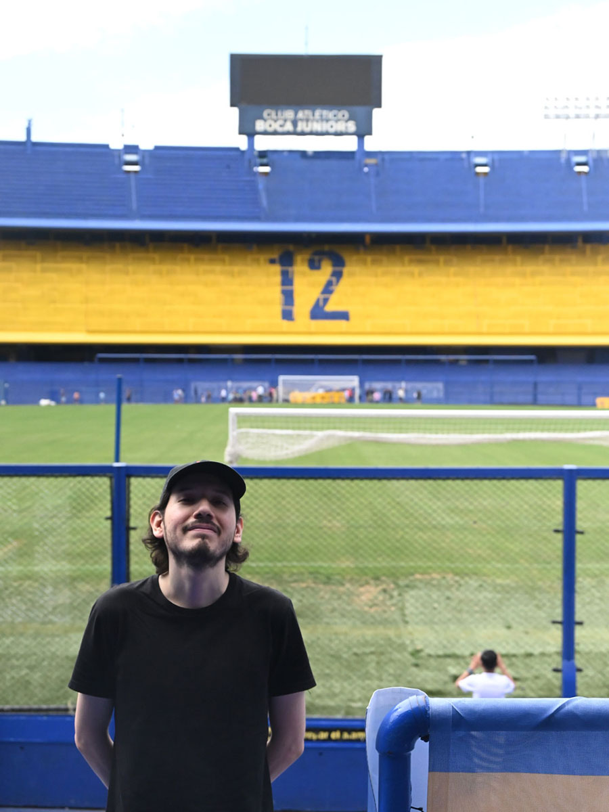

# Hello, I'm David

Hello, my full name is David Andrés Cerón Chingual.  
I'm 19, and my birthday is the 6th of September. 
I was born in Colombia, in the city of Pasto. I moved to Canada in August 2024 with my mother and my dog, Shadow, who is the fella of the image. 
I enjoy drawing, reading manga, riding bike, martial arts, and spending time with my dog.

## Homework-1-MMED1054
Repository for the team homework in MMED 1054.

## Jordan Chuquillanqui - About Me

### Name & more info about me

- My full name is Jordan Stefano Chuquillanqui Guerra.
- I am from Peru.
- My birthday is on Christmas day, and I am 28 years old.

### Hobies

- Watch movie trailers to discover music.
- Travel and collect stickers of all kinds.
- Go snowboarding and take photos at sports events.

### My Favourite Movies

- *Mad Max: Fury Road*
- *Blade Runner 2049*
- *Joker*

## Installation
No installation required.

## Usage
Open in Github.com

## Contributing
Fork it!
Create your feature branch: git checkout -b my-new-feature
Commit your changes: git commit -am 'Add some feature'
Push to the branch: git push origin my-new-feature
Submit a pull request

## History
Not available.

## Credits
- Jordan Chuquillanqui
- David Cerón

## License
No license.
